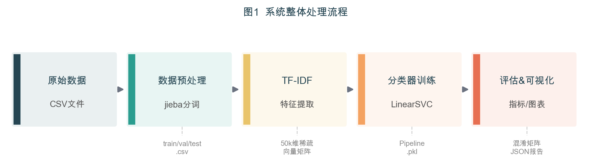
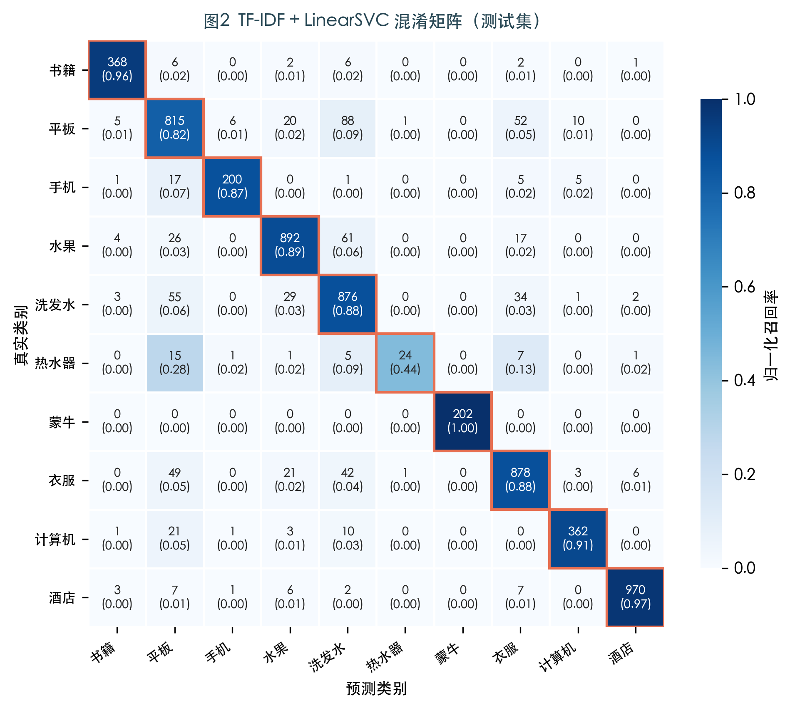
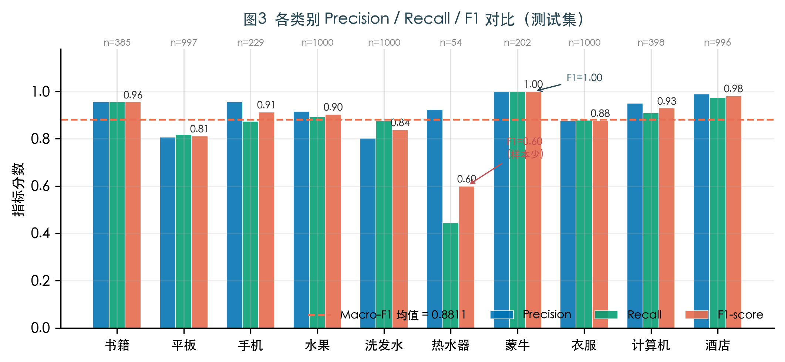

# 基于TF-IDF与支持向量机的中文商品评论多分类研究

**A Study on Chinese Product Review Multi-Classification Based on TF-IDF and Support Vector Machine**

姓名（学号），指导教师（职称）

（重庆邮电大学 计算机科学与技术学院，重庆 400065）

---

**摘　要：** 针对电商平台海量中文评论的自动分类需求，提出一种基于TF-IDF特征提取与线性支持向量机（LinearSVC）的中文文本多分类方法。以online\_shopping\_10\_cats公开数据集为实验对象，对约6.2万条真实购物评论进行jieba中文分词、停用词过滤及文本清洗等预处理操作，利用TF-IDF算法将文本映射为50 000维稀疏向量，并引入二元语法（Bigram）特征以捕获局部词序信息。分别训练LinearSVC、多项式朴素贝叶斯（MultinomialNB）和逻辑回归（Logistic Regression）三种分类器并进行对比分析。实验结果表明，TF-IDF与LinearSVC的组合方案效果最优，在10类商品评论测试集上取得89.23%的分类准确率和88.11%的宏平均F1值，蒙牛、酒店、书籍等类别F1值均超过0.95，整体训练耗时仅约7.6 s，验证了传统机器学习方法在中文文本分类任务上的实用性。

**关键词：** 中文文本分类；TF-IDF；支持向量机；朴素贝叶斯；逻辑回归；商品评论

**中图分类号：** TP391　　**文献标志码：** A

---

**Abstract:** To address the automatic classification of massive Chinese reviews on e-commerce platforms, a Chinese text multi-classification method based on TF-IDF feature extraction and Linear Support Vector Machine (LinearSVC) is proposed. Using the public dataset online\_shopping\_10\_cats containing approximately 62,000 real shopping reviews across 10 categories, the pipeline performs jieba Chinese word segmentation, stopword filtering and text cleaning as preprocessing steps, then maps each review into a 50,000-dimensional sparse vector via TF-IDF with bigram features to capture local word-order information. Three classifiers—LinearSVC, Multinomial Naive Bayes (MultinomialNB), and Logistic Regression—are trained and compared. Experimental results show that the TF-IDF + LinearSVC combination achieves the best performance, with a classification accuracy of 89.23% and a macro-averaged F1 score of 88.11% on the test set. Categories such as Mengniu dairy, hotel, and books achieve F1 scores exceeding 0.95. The total training time is only about 7.6 s, demonstrating the practicality of traditional machine learning methods for Chinese text classification.

**Keywords:** Chinese text classification; TF-IDF; support vector machine; Naive Bayes; logistic regression; product review

---

## 0　引　言

随着电子商务的迅猛发展，淘宝、京东等平台每日产生海量用户评论，这些数据蕴含丰富的消费意见与市场信号，对商家经营决策、平台内容管理和消费者购买参考均具有重要价值。然而，人工逐条阅读和标注评论的方式成本高昂且难以扩展，自动文本分类技术因此成为研究热点。

中文文本分类相比英文面临更多挑战：中文书写不以空格分词，需借助专用工具切分词边界；同义词、网络新词及口语化表达增加了语义歧义；此外，电商评论文本普遍存在类别不均衡问题。

文本分类研究大体经历了三个阶段：基于规则与词典的方法可解释性强但维护成本高；基于统计机器学习的方法（TF-IDF + SVM/NB/LR）在新闻分类、情感分析等任务上取得良好效果，且对算力要求低；以BERT[1]为代表的预训练语言模型则在下游分类任务上取得大幅领先的效果，成为当前主流方案，但其对GPU算力的依赖使得在资源受限场景下的部署受到制约。

本文聚焦于传统机器学习方法，基于TF-IDF特征提取框架，系统实现并对比LinearSVC、MultinomialNB和Logistic Regression三种分类器在10类中文商品评论数据集上的性能，为后续引入深度学习方法提供实验基线。

## 1　相关工作

Yang等[2]系统对比了多种机器学习算法在Reuter-21578等标准文本分类数据集上的表现，发现SVM与kNN整体最优，SVM在高维稀疏特征空间下尤为突出。Joachims[3]最早将SVM应用于文本分类，指出文本数据天然适合线性分类器，线性核SVM的分类效果往往不亚于非线性核。

在特征表示方面，Salton等[4]提出的TF-IDF加权方案至今仍是文本分类基线方法的核心组件。Zhang等[5]的研究表明，引入Bigram特征能在词袋模型基础上有效捕捉局部词序，提升分类准确率。

在中文文本处理方面，孙茂松等[6]对汉语词法分析进行了系统综述，指出基于前缀词典与隐马尔可夫模型（HMM）的分词策略能较好平衡分词速度与精度；jieba分词库即采用该策略，在工业界获得广泛应用。

近年来，以TextCNN[7]、TextRNN为代表的深度学习方法和以BERT为代表的预训练语言模型进一步提升了中文文本分类性能，但其显著优势依赖于大量标注数据与较高算力投入。本文的传统机器学习基线研究具有独立的参考价值。

## 2　模型原理及具体开发实现

### 2.1　系统整体架构

系统由数据预处理、TF-IDF特征提取、分类器训练与评估可视化四个模块构成，处理流程如图1所示。



**图1　系统整体处理流程**

**Fig.1　Overall processing pipeline of the proposed system**

原始CSV数据经预处理模块完成分词与集合划分后，以分词令牌（token）序列存入结构化CSV文件；特征工程模块对训练集拟合TF-IDF向量化器并对全部集合进行转换；分类器训练模块在训练集上拟合分类器并在验证集上选择最优超参数；评估模块在测试集上输出完整分类指标并生成可视化报告。

### 2.2　数据预处理

#### 2.2.1　数据清洗

原始数据集共62 774条记录，经以下步骤清洗后得到62 605条有效数据：

1. 删除类别（cat）或评论（review）字段存在空值的记录（共1条）；
2. 以"类别+评论内容"为键去除重复记录（共17条）；
3. 过滤评论文本长度小于5字符的过短记录（共151条）。

#### 2.2.2　中文分词

中文文本不以空格分词，需专用工具切分词边界。本文使用jieba分词库，采用精确模式（`cut_all=False`）进行分词。jieba基于前缀词典与HMM模型实现，对歧义词和未登录词均有较好的处理能力[6]。

核心分词实现如下：

```python
def tokenize(text: str, stopwords: set) -> str:
    tokens = jieba.cut(text, cut_all=False)          # 精确模式分词
    filtered = [t for t in tokens
                if t.strip() and t not in stopwords] # 去空白与停用词
    return " ".join(filtered)                        # 空格分隔供向量化器使用
```

分词后每条评论转化为空格分隔的词元字符串，例如：

> 原文：`这款手机信号很差，非常失望`  
> 分词：`这款 手机 信号 很 差 非常 失望`

#### 2.2.3　数据集划分

采用分层随机抽样（Stratified Split）按8:1:1比例划分训练集、验证集与测试集，保证各类别样本在三个子集中的分布比例与全集一致，避免因类别不均衡导致的评估偏差。划分结果见表1。

**表1　数据集划分统计**

**Table 1　Statistics of dataset splits**

| 子集 | 样本数 | 比例 |
|:----:|:------:|:----:|
| 训练集 | 50 083 | 80% |
| 验证集 | 6 261  | 10% |
| 测试集 | 6 261  | 10% |
| 合计   | 62 605 | 100% |

### 2.3　TF-IDF特征提取

#### 2.3.1　基本原理

TF-IDF（Term Frequency–Inverse Document Frequency）是信息检索中最经典的文本向量化方法，其核心思想为：某个词在文档中出现频率越高、在整个语料库中出现越稀少，则该词对该文档的类别区分度越强[4]。

设词元 $t$ 在文档 $d$ 中的词频为 $\text{count}(t,d)$，语料库文档总数为 $N$，包含词元 $t$ 的文档数为 $\text{df}(t)$，则：

$$\text{TF}(t,d) = 1 + \log(\text{count}(t,d))$$

$$\text{IDF}(t) = \log\frac{1+N}{1+\text{df}(t)} + 1$$

$$\text{TF-IDF}(t,d) = \text{TF}(t,d) \times \text{IDF}(t)$$

其中TF项采用次线性平滑（`sublinear_tf=True`），以缓解高频词主导效应；最终对每篇文档的TF-IDF向量做L2归一化，消除文本长度的影响。

#### 2.3.2　Bigram特征扩充

除单词（Unigram）外，本文引入相邻两词构成的词对（Bigram）作为补充特征，即将`ngram_range`设为`(1, 2)`。Bigram能捕捉局部词序信息，例如"非常 满意""质量 差"等短语的判别力往往强于单个词[5]。

向量化器主要参数设置如下：

```python
tfidf = TfidfVectorizer(
    analyzer="word",
    token_pattern=r"\S+",  # 以空白符分割，支持中文词元
    max_features=50000,    # 按权重保留前5万个特征
    ngram_range=(1, 2),    # Unigram + Bigram
    sublinear_tf=True,     # 1+log(tf) 平滑
    min_df=2,              # 过滤超低频词（<2篇文档）
    max_df=0.95,           # 过滤超高频词（近似停用词）
)
```

### 2.4　分类模型

本文基于`sklearn.pipeline.Pipeline`将TF-IDF向量化器与分类器封装为统一的训练推理流水线，并对比以下三种经典分类算法。

#### 2.4.1　线性支持向量机（LinearSVC）

SVM通过寻找最优超平面使不同类别样本间的间隔最大化[3]。引入松弛变量后，优化目标为：

$$\min_{w,b,\xi}\frac{1}{2}\|w\|^2+C\sum_{i}\xi_i, \quad \text{s.t.}\; y_i(w\cdot x_i+b)\geq 1-\xi_i,\;\xi_i\geq 0$$

其中 $C$ 为正则化参数，控制间隔宽度与误分类惩罚之间的权衡。多分类问题采用One-vs-Rest策略，为每个类别训练一个二分类器，取置信度最高的类别作为最终预测。LinearSVC针对线性核进行了专项优化，时间复杂度远低于核SVM，对高维稀疏文本特征尤为适合。

#### 2.4.2　多项式朴素贝叶斯（MultinomialNB）

朴素贝叶斯基于贝叶斯定理，假设各特征（词元）在给定类别下条件独立：

$$P(y\mid x_1,\ldots,x_n)\propto P(y)\prod_{i=1}^{n}P(x_i\mid y)$$

MultinomialNB适用于词频计数特征，引入拉普拉斯平滑（$\alpha$参数）处理零概率：

$$P(x_i\mid y)=\frac{\text{count}(x_i,y)+\alpha}{\sum_j\text{count}(x_j,y)+\alpha\cdot|V|}$$

#### 2.4.3　逻辑回归（Logistic Regression）

逻辑回归通过Softmax函数对多分类后验概率建模，采用最大似然估计加L2正则化训练参数：

$$P(y=k\mid x)=\frac{e^{w_k\cdot x}}{\sum_{j}e^{w_j\cdot x}}$$

逻辑回归可输出类别概率，便于设置置信度阈值进行不确定性分析。

### 2.5　评估指标

采用以下指标综合评估分类性能：

- **准确率（Accuracy）**：预测正确样本占总样本的比例，反映整体分类能力；
- **精确率（Precision）**：预测为某类别中真正属于该类的比例，反映查准能力；
- **召回率（Recall）**：某类别中被正确预测的比例，反映查全能力；
- **F1值**：Precision与Recall的调和均值，综合反映查准与查全；
- **宏平均F1（Macro-F1）**：各类别F1的简单均值，对类别不均衡敏感，反映少数类处理能力；
- **加权平均F1（Weighted-F1）**：按各类别支持数加权的F1均值。

## 3　实验数据集及相关参数设置

### 3.1　数据集

本文使用online\_shopping\_10\_cats数据集，评论来源于京东、淘宝、大众点评等主流电商平台，为真实用户评论数据。数据集覆盖10个商品/服务类别，测试集各类别样本分布如表2所示。

**表2　测试集类别分布**

**Table 2　Category distribution in the test set**

| 类别 | 测试集样本数 | 占比 |
|:----:|:-----------:|:----:|
| 书籍   | 385  | 6.1% |
| 平板   | 997  | 15.9% |
| 手机   | 229  | 3.7% |
| 水果   | 1 000 | 16.0% |
| 洗发水 | 1 000 | 16.0% |
| 热水器 | 54   | 0.9% |
| 蒙牛   | 202  | 3.2% |
| 衣服   | 1 000 | 16.0% |
| 计算机 | 398  | 6.4% |
| 酒店   | 996  | 15.9% |
| **合计** | **6 261** | **100%** |

数据集存在明显的类别不均衡：热水器测试样本仅54条（占0.9%），而水果、洗发水、衣服各有1 000条（占16.0%），最大/最小类别样本比约18.5:1。

### 3.2　参数设置

实验中各关键参数设置如表3所示，所有实验在相同随机种子（seed=42）下进行，保证结果可复现。

**表3　主要实验参数**

**Table 3　Main experimental parameters**

| 参数 | 取值 | 说明 |
|:-----|:----:|:-----|
| 随机种子 | 42 | 数据划分与模型训练复现性 |
| 最短文本长度 | 5字符 | 过滤无效短文本 |
| 训练/验证/测试比例 | 8:1:1 | 分层抽样 |
| TF-IDF词表大小 | 50 000 | 按权重取前50 000个特征 |
| n-gram范围 | (1, 2) | Unigram + Bigram |
| `sublinear_tf` | True | 次线性TF平滑 |
| `min_df` | 2 | 过滤低于2篇文档的词元 |
| `max_df` | 0.95 | 过滤覆盖95%以上文档的词元 |
| SVM正则化参数 $C$ | 1.0 | 默认值，收敛性良好 |
| SVM最大迭代次数 | 2 000 | 确保线性规划求解器收敛 |
| NB平滑参数 $\alpha$ | 1.0 | 标准拉普拉斯平滑 |
| LR正则化参数 $C$ | 1.0 | L2正则，`lbfgs`求解器 |

## 4　作品运行结果展示及实验结果分析

### 4.1　整体性能对比

表4给出三种模型在测试集上的整体性能对比。

**表4　三种模型测试集性能对比**

**Table 4　Performance comparison of three models on the test set**

| 模型 | Accuracy | Macro-F1 | Weighted-F1 | 训练耗时/s |
|:-----|:--------:|:--------:|:-----------:|:---------:|
| TF-IDF + LinearSVC（本文） | **89.23%** | **88.11%** | **89.24%** | **7.6** |
| TF-IDF + LogisticRegression | 88.61% | 84.95% | 88.56% | 8.5 |
| TF-IDF + MultinomialNB | 84.91% | 75.28% | 84.43% | 2.3 |

LinearSVC方案在准确率与宏平均F1两项指标上均取得最优，且训练耗时最短（约7.6 s），适合资源受限的部署场景。

### 4.2　各类别分类指标

图2为TF-IDF + LinearSVC在测试集上的混淆矩阵，图3为各类别Precision/Recall/F1对比图，各类别详细指标见表5。



**图2　TF-IDF + LinearSVC混淆矩阵（测试集，行归一化）**

**Fig.2　Confusion matrix of TF-IDF + LinearSVC on the test set (row-normalized)**



**图3　各类别Precision / Recall / F1对比**

**Fig.3　Per-class Precision, Recall and F1-score comparison**

**表5　各类别详细分类指标**

**Table 5　Detailed per-class classification metrics**

| 类别 | Precision | Recall | F1-score | 支持数 |
|:----:|:---------:|:------:|:--------:|:------:|
| 书籍   | 0.956 | 0.956 | 0.956 | 385 |
| 平板   | 0.806 | 0.817 | 0.812 | 997 |
| 手机   | 0.957 | 0.873 | 0.913 | 229 |
| 水果   | 0.916 | 0.892 | 0.904 | 1 000 |
| 洗发水 | 0.803 | 0.876 | 0.838 | 1 000 |
| 热水器 | **0.923** | **0.444** | **0.600** | 54 |
| 蒙牛   | **1.000** | **1.000** | **1.000** | 202 |
| 衣服   | 0.876 | 0.878 | 0.877 | 1 000 |
| 计算机 | 0.950 | 0.910 | 0.929 | 398 |
| 酒店   | 0.990 | 0.974 | 0.982 | 996 |
| 宏平均 | 0.918 | 0.862 | 0.881 | 6 261 |
| 加权均值 | 0.895 | 0.892 | 0.892 | 6 261 |

### 4.3　结果分析

**（1）整体性能良好。** TF-IDF + LinearSVC在10分类任务上取得89.23%的准确率，证明传统机器学习方法在中文商品评论分类任务上仍具备实用价值，且无需GPU即可在秒级完成训练。

**（2）蒙牛类别识别近乎完美（F1=1.00）。** 蒙牛属于特定品牌的乳制品，评论文本中含有高频且高度特异的品牌词（"蒙牛"、"牛奶"、"乳"等），这些词在其他类别中几乎不出现，TF-IDF能赋予其极高权重，从而实现近乎完美的分类。

**（3）酒店与书籍类别效果优异（F1≥0.95）。** 酒店评论包含"入住"、"前台"、"房间"等高频领域专用词；书籍评论含有"作者"、"章节"、"阅读"等特有词汇，两类均与其他商品类别存在清晰的词汇边界，因此取得较高F1。

**（4）热水器类别召回率显著偏低（Recall=0.444，F1=0.600）。** 原因有二：①训练样本严重不足，热水器训练样本仅435条，占训练集的0.87%，严重的类别不均衡导致分类器对该类别学习不足；②热水器属家用电器，评论词汇（"安装"、"热水"、"效果"等）与计算机、平板等数码产品存在语义重叠。后续可通过过采样（SMOTE）或设置类别权重（`class_weight='balanced'`）缓解。

**（5）平板与洗发水存在一定错分。** 平板、手机、计算机同属数码产品，评论中均出现"屏幕"、"性能"、"系统"等共有特征词；洗发水与衣服均为消费品，评论风格相近，易产生混淆。这也体现了词袋模型忽略词序和语义信息的固有局限性。

## 5　结　论

本文以中文商品评论多分类为研究对象，系统实现了从原始数据清洗、jieba中文分词、TF-IDF特征提取到分类器训练与测试评估的完整机器学习流程。以online\_shopping\_10\_cats数据集为实验平台，对比了LinearSVC、MultinomialNB和Logistic Regression三种经典分类方案。

实验结果表明，TF-IDF + LinearSVC方案综合性能最优，在10类商品评论测试集上取得89.23%的准确率和88.11%的宏平均F1值，蒙牛、酒店、书籍等类别F1超过0.95，训练耗时约7.6 s，验证了传统机器学习方法在中文文本分类任务上的有效性与高效性。

现有方法存在两点局限：①类别不均衡问题导致少数类（热水器）召回率偏低；②TF-IDF词袋模型忽略词序和深层语义，对语义相近类别（数码产品间）的区分能力有限。后续工作可沿以下方向改进：引入停用词过滤进一步净化特征空间；利用预训练词向量（Word2Vec、fastText）或基于BERT的句向量替代TF-IDF以引入语义信息；针对不均衡类别采用过采样（SMOTE）或代价敏感学习策略。

## 致　谢

感谢指导教师的悉心指导和重庆邮电大学自然语言处理课程组提供的实验平台。

---

## 参考文献

[1] DEVLIN J, CHANG M W, LEE K, et al. BERT: pre-training of deep bidirectional transformers for language understanding[C]// Proceedings of NAACL-HLT 2019. Minneapolis: Association for Computational Linguistics, 2019: 4171-4186.

[2] YANG Y, LIU X. A re-examination of text categorization methods[C]// Proceedings of the 22nd Annual International ACM SIGIR Conference. Berkeley: ACM, 1999: 42-49.

[3] JOACHIMS T. Text categorization with support vector machines: learning with many relevant features[C]// Proceedings of ECML-98. Berlin: Springer, 1998: 137-142.

[4] SALTON G, BUCKLEY C. Term-weighting approaches in automatic text retrieval[J]. Information Processing & Management, 1988, 24(5): 513-523.

[5] ZHANG Y, JIN R, ZHOU Z H. Understanding bag-of-words model: a statistical framework[J]. International Journal of Machine Learning and Cybernetics, 2010, 1(1-4): 43-52.

[6] 孙茂松, 李涓子. 汉语词法分析[M]. 北京: 清华大学出版社, 2004: 1-30.

SUN M S, LI J Z. Chinese lexical analysis[M]. Beijing: Tsinghua University Press, 2004: 1-30.

[7] KIM Y. Convolutional neural networks for sentence classification[C]// Proceedings of EMNLP 2014. Doha: Association for Computational Linguistics, 2014: 1746-1751.

[8] PEDREGOSA F, VAROQUAUX G, GRAMFORT A, et al. Scikit-learn: machine learning in Python[J]. Journal of Machine Learning Research, 2011, 12: 2825-2830.

---

## 附录：代码运行说明

### 环境要求

- Python 3.9+，依赖库见`requirements.txt`

### 安装与运行

```bash
cd 自然语言处理大作业

# 创建虚拟环境并安装依赖（清华镜像）
python3 -m venv .venv
source .venv/bin/activate
pip install -r requirements.txt -i https://pypi.tuna.tsinghua.edu.cn/simple

# 第一步：数据预处理（jieba分词 + 数据划分）
python code/preprocess.py --config configs/default.yaml

# 第二步：模型训练
python code/train.py --config configs/default.yaml

# 第三步：测试集评估（生成混淆矩阵和指标图表）
python code/evaluate.py --config configs/default.yaml

# 第四步（可选）：单条文本预测
python code/predict.py --text "这款手机信号很差，非常失望"

# 生成论文级图表
python figures/gen_fig_pipeline.py
python figures/gen_fig_confusion.py
python figures/gen_fig_metrics.py
```

### 切换模型

修改`configs/default.yaml`中的`train.model_type`字段（`tfidf_svm` / `tfidf_nb` / `tfidf_lr`），再重新执行训练与评估步骤即可。

### 输出文件说明

| 文件路径 | 说明 |
|:---------|:-----|
| `data/processed/train.csv` | 训练集（含分词结果） |
| `data/processed/test.csv` | 测试集 |
| `models/tfidf_svm_model.pkl` | 训练好的TF-IDF + SVM Pipeline |
| `models/label_encoder.pkl` | 标签编码器 |
| `results/classification_report.json` | 完整分类指标JSON |
| `figures/fig_pipeline.png/pdf` | 系统流程图 |
| `figures/fig_confusion.png/pdf` | 混淆矩阵热力图 |
| `figures/fig_metrics.png/pdf` | 各类别指标对比图 |

---

*[作者简介]*  
姓名（出生年－），性别，籍贯，重庆邮电大学计算机科学与技术学院学生，主要研究方向为自然语言处理、机器学习。E-mail：
